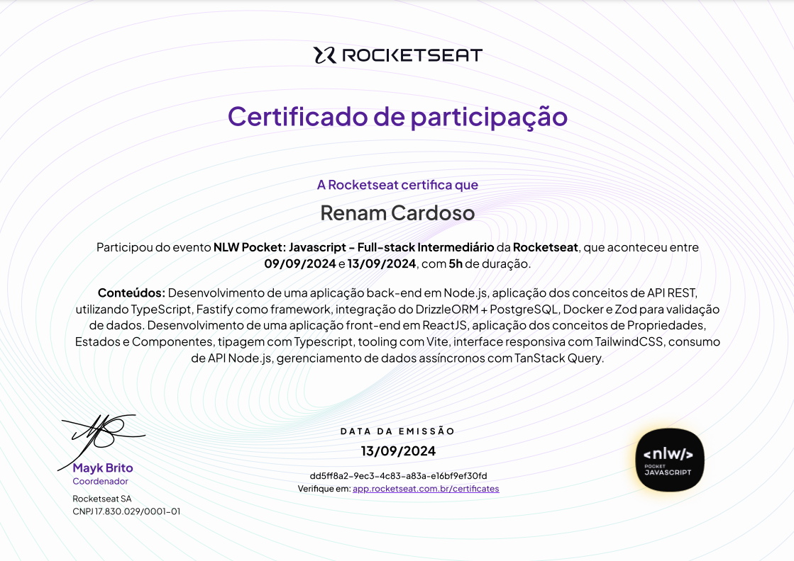

  

## 🖥️ Projeto

Esse projeto foi desenvolvido durante o NLW Pocket Javascript da Rocketseat.

## 🚀 Tecnologias

Esse projeto foi desenvolvido com as seguintes tecnologias:

- Desenvolvimento do back-end em Node.js
- Desenvolvimento do front-end em ReactJs
- TailwindCSS
- Aplicação de API REST com TypeScript
- Fastify como framework
- Integração do DrizzleORM + PostgreSQL
- Docker e Zod para validação de Dados
- Entre outras ferramentas como Vite e TanStack Query
- Git e Github
